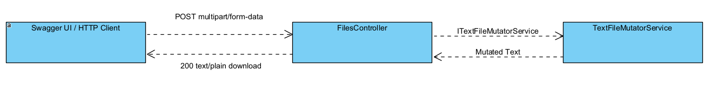

# DakLaPack File Mutation API

A small .NET REST API that accepts a `.txt` file, appends a UTC timestamp and a cryptographically random token, and returns the result as a download.

## Run locally

```powershell
dotnet run --project FileMutation/FileMutation.csproj
```

Open Swagger UI at `http://localhost:5253/swagger`, select `POST /api/files/mutate`, upload a `.txt` file of up to 1 MB, and execute the request. The response is returned as `text/plain` with a `-mutated.txt` download name.

## Design

- `FilesController` handles HTTP validation, reads the uploaded file, and returns the download response.
- `ITextFileMutatorService` defines the mutation operation and is registered through dependency injection.
- `TextFileMutatorService` appends `DateTime.UtcNow` and a random 16-character hexadecimal token generated with `RandomNumberGenerator`.

The design intentionally uses a small service rather than CQRS/MediatR because the assignment contains one independent operation. This keeps the API easy to follow while preserving a clear HTTP/domain boundary.

## Architecture



1. Swagger UI uploads a text file to `POST /api/files/mutate`.
2. `FilesController` validates and reads the uploaded content.
3. The controller calls `ITextFileMutatorService`, which is implemented by `TextFileMutatorService`.
4. The controller returns the mutated text as a downloadable `-mutated.txt` file.

## Separation of responsibilities

The controller is limited to transport concerns: receiving the HTTP upload, validating the request, reading the stream, and returning an HTTP response. `TextFileMutatorService` contains only the mutation rule and has no dependency on ASP.NET Core request or response types. The interface allows the controller to depend on the required behavior rather than a concrete implementation.

This separation is demonstrated by the tests: service tests verify the mutation rule directly, while controller tests verify multipart binding, validation, response status codes, headers, and download behavior.

## Future improvements

This assignment intentionally keeps the implementation small. Before exposing the API outside a trusted environment, I would add:

- Authentication and authorization, for example OAuth/JWT or API keys, so only approved clients can call the mutation endpoint.
- HTTPS-only deployment and CORS rules that allow only known frontend origins.
- Request-rate limits and streaming support for larger files to protect against abuse and reduce memory use.
- Content validation beyond the `.txt` extension, including encoding checks and, where appropriate, malware scanning.
- Structured audit logging that records request metadata without storing sensitive file content.
- Centralized error handling and health checks for an operational deployment.

If the application grows into multiple file operations, persistence, audit events, or shared validation and authorization pipelines, I would introduce CQRS/MediatR. At the current size, the injected service provides the same separation with less indirection.

## Validation

```powershell
dotnet test FileMutation.Tests/FileMutation.Tests.csproj
```

The test suite covers mutation metadata, invalid uploads, empty and oversized text files, and a successful upload/download response.